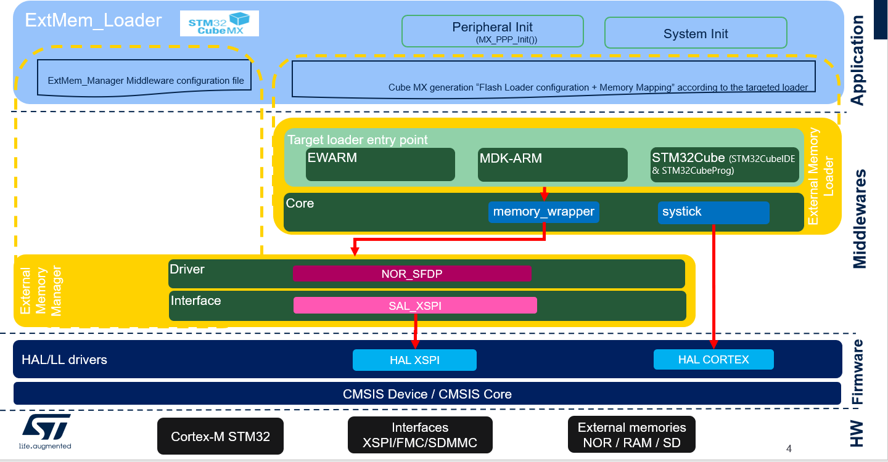

::: {.row}
::: {.col-sm-12 .col-lg-4}

# Release Notes for
# <mark>STM32_ExtMem_Loader</mark>
Copyright &copy; 2023 STMicroelectronics\

{.logo}

# Purpose

**The source code delivered is a middleware that helps user building its own loader for external SFDP NOR memories.</mark>**

The STM32Cube firmware solution offers a straightforward API with a modular architecture, making it simple to fine tune custom applications and scalable to fit most requirements.

\

Here is the list of references to user documents:

- [WIKI Page](https://wiki.st.com/stm32mcu/wiki/
Getting_started_with_External_memory_Manager_and_External_memory_loader): Getting started with 
External memory Manager

:::

::: {.col-sm-12 .col-lg-8}
# Update History
::: {.collapse}
<input type="checkbox" id="collapse-section2" checked aria-hidden="true">
<label for="collapse-section2" aria-hidden="true">__V1.1.0 / 24-April-2024__</label>

## Main Changes

- Update to support memories programming with openbootloader using bootloader interfeces. 

## Contents

## Known limitations

 - List of the tested memories
   - SFDP : MACRONIX MX66UW1G45G
   - SFDP : MACRONIX MX25UW25645G

- List of the tested and supported bootloader interfaces in STM32Cubeprogrammer:
  - USART
  - USB

## Development Toolchains and Compilers

- IAR Embedded Workbench for ARM (EWARM) toolchain V9.20.1.
- Keil MDK-ARM toolchain V5.38 using ARM Compiler 6.
- STM32CubeIDE toolchain v1.15.0  using GCC compiler 12.

## Supported Devices and boards

- Not applicable

## Backward Compatibility

- Not applicable

## Dependencies

- Not applicable

:::

::: {.collapse}
<input type="checkbox" id="collapse-section1" aria-hidden="true">
<label for="collapse-section1" aria-hidden="true">__V1.0.0 / 28-February-2024__</label>

## Main Changes

First official version for STM32H7Rs/Sx devices.

## Contents

## Known limitations

 - List of the tested memories
   - SFDP : MACRONIX MX66UW1G45G
   - SFDP : MACRONIX MX25UW25645G

## Development Toolchains and Compilers

- IAR Embedded Workbench for ARM (EWARM) toolchain V9.20.1.
- Keil MDK-ARM toolchain V5.38 using ARM Compiler 6.
- STM32CubeIDE toolchain v1.15.0  using GCC compiler 12.

## Supported Devices and boards

- Not applicable

## Backward Compatibility

- Not applicable

## Dependencies

- Not applicable

:::

:::
:::

<footer class="sticky">
::: {.columns}
::: {.column width="95%"}
:::
::: {.column width="5%"}
<abbr title="Based on template cx566953 version 2.1">Info</abbr>
:::
:::
</footer>
