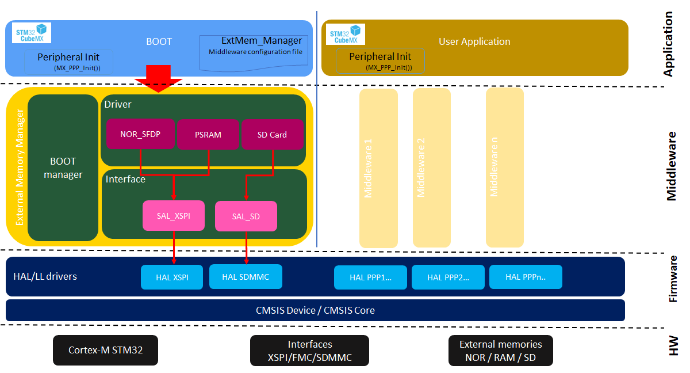

::: {.row}
::: {.col-sm-12 .col-lg-4}

# Release Notes for
# <mark>STM32_ExtMem_Manager</mark>
Copyright &copy; 2024 STMicroelectronics\

{.logo}

# Purpose

The source code delivered is a middleware to manage different types of external memory.

The STM32_ExtMem_Manager component provides SW implementation that facilitates external memories integration.

It supports Serial Flash Discovery Parameters (JEDEC SFDP, aligned with JEDEC standard JESD216F.02) to facilitate serial NOR Flash integration.

Thanks to STM32_ExtMem_Manager's high scalability, support of multiple external memory types(NOR, RAM, SD) and interface types (XSPI, SDMMC, FMC) becomes easier.

\

Here is the list of references to user documents:

- [WIKI Page](https://wiki.st.com/stm32mcu/wiki/Getting_started_with_External_memory_Manager_and_External_memory_loader): Getting started with External memory Manager

:::

::: {.col-sm-12 .col-lg-8}
# Update History

::: {.collapse}
<input type="checkbox" id="collapse-section3" checked aria-hidden="true">
<label for="collapse-section3" aria-hidden="true">__V1.3.0 / 17-December-2024__</label>

## Release update

  - doc : code comment update

## Known limitations

 - See supported memories

## Supported memories

 - List of the tested memories
   - NOR_SFDP : 
      - MACRONIX MX66UW1G45G, MX25UW25645G, MX25LM51245G
      - WINBOND  W25Q64JV
   - PSRAM: APMEMORY APS256XXN
   - SDCARD: micro SD kingstone 1GB

## Supported Devices and boards

- Not applicable

## Backward Compatibility

- Not applicable

## Dependencies

- Not applicable

:::

::: {.collapse}
<input type="checkbox" id="collapse-section3" aria-hidden="true">
<label for="collapse-section3" aria-hidden="true">__V1.2.0 / 09-October-2024__</label>

## Release update

  - fix : jump issue without compiler optim
  - fix : performance issue detected in security context

## Known limitations

 - See supported memories

## Supported memories

 - List of the tested memories
   - NOR_SFDP : 
      - MACRONIX MX66UW1G45G, MX25UW25645G, MX25LM51245G
      - WINBOND  W25Q64JV
   - PSRAM: APMEMORY APS256XXN
   - SDCARD: micro SD kingstone 1GB

## Supported Devices and boards

- Not applicable

## Backward Compatibility

- Not applicable

## Dependencies

- Not applicable

:::

::: {.collapse}
<input type="checkbox" id="collapse-section2" aria-hidden="true">
<label for="collapse-section2" aria-hidden="true">__V1.1.0 / 29-May-2024__</label>

## Release update

  - NOR_SFDP : 
    - update for memory presenting only short basic JEDEC table
    - update to add frequency upgrade when JEDEC doesn't provide frequency information
	- fix issue detected during octal activation requiring adding WIP operations
  - SAL_XSPI : 
    - update to support DMA transfer

## Known limitations

 - See supported memories

## Supported memories

 - List of the tested memories
   - NOR_SFDP : 
      - MACRONIX MX66UW1G45G, MX25UW25645G, MX25LM51245G
      - WINBOND  W25Q64JV
   - PSRAM: APMEMORY APS256XXN
   - SDCARD: micro SD kingstone 1GB

## Supported Devices and boards

- Not applicable

## Backward Compatibility

- Not applicable

## Dependencies

- Not applicable

:::

::: {.collapse}
<input type="checkbox" id="collapse-section1" aria-hidden="true">
<label for="collapse-section1" aria-hidden="true">__V1.0.0 / 28-February-2024__</label>

## First release

  First official release of STM32_ExtMem_Manager

## Known limitations

 - List of the tested memories
   - NOR_SFDP : MACRONIX MX66UW1G45G, MX25UW25645G
   - PSRAM: APMEMORY APS256XXN
   - SDCARD: micro SD kingstone 1GB

## Supported Devices and boards

- Not applicable

## Backward Compatibility

- Not applicable

## Dependencies

- Not applicable

:::
:::
:::

<footer class="sticky">
::: {.columns}
::: {.column width="95%"}
:::
::: {.column width="5%"}
<abbr title="Based on template cx566953 version 2.1">Info</abbr>
:::
:::
</footer>
